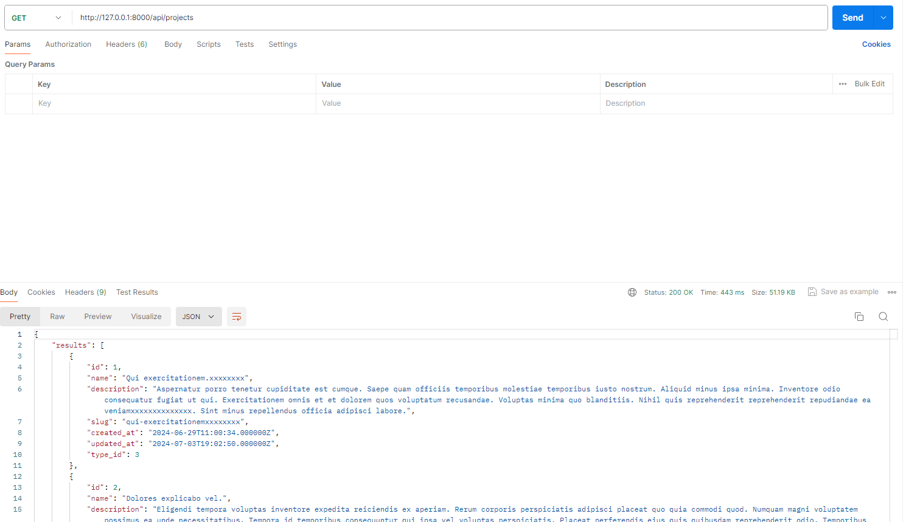
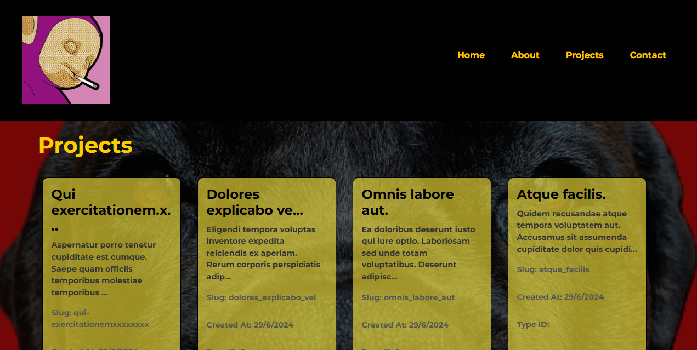
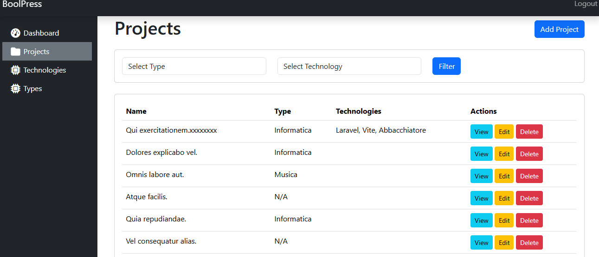

# Boolfolio - API & Frontend

## Overview

Boolfolio integrates a Laravel backend API with a Vue.js frontend using Vite. 

## Features

- **Backend API** 
  - RESTful endpoints
  - JSON responses
  - Secure and efficient

- **Frontend** 
  - Data fetching with Axios
  - Responsive design
  - Pagination

## Milestones

### Milestone 1: Laravel API 
- Create `Api/ProjectController` to return project data in JSON.

### Milestone 2: Test API 
- Verify API response with Postman.

### Milestone 3: Vue.js Setup 
- Set up Vue 3 with Vite and Axios.

### Milestone 4: Fetch Data ![Fetch]
- Fetch and display project data in Vue.js.

### Milestone 5: Project Cards
- Create `ProjectCard` component for displaying projects.

### Bonus: Pagination
- Implement pagination in the frontend.

## Screenshots

### Backend Dashboard 

### Contact Page 

---
